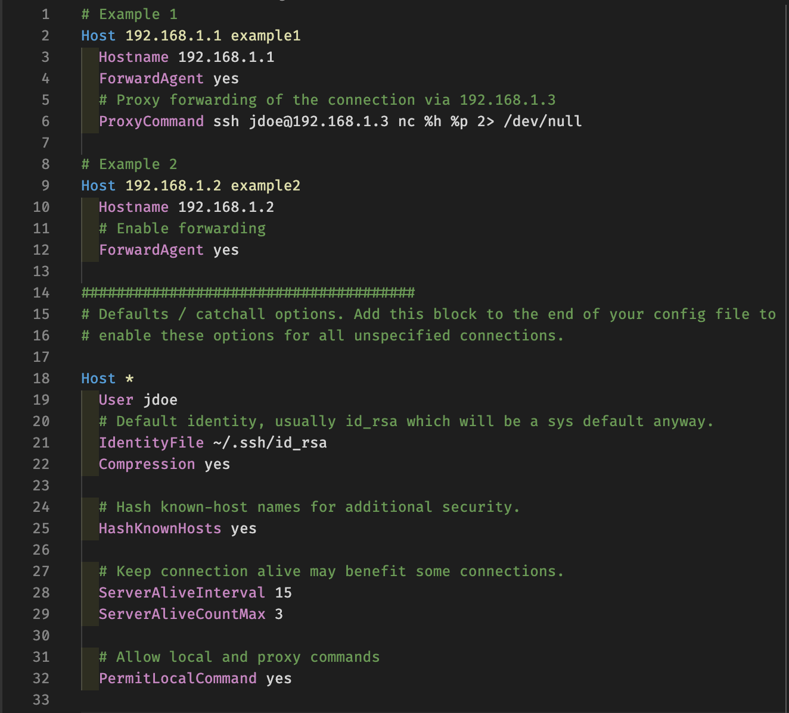

# ssh-config-syntax-highlighter

The SSH Config Visual Studio Code (VS Code) extension adds syntax highlighting for ssh config files (normally exist in `~/.ssh/config` or `/etc/ssh/ssh_config`).

Install from vscode [marketplace](https://marketplace.visualstudio.com/items?itemName=mousavian.ssh-config-syntax-highlighter).

